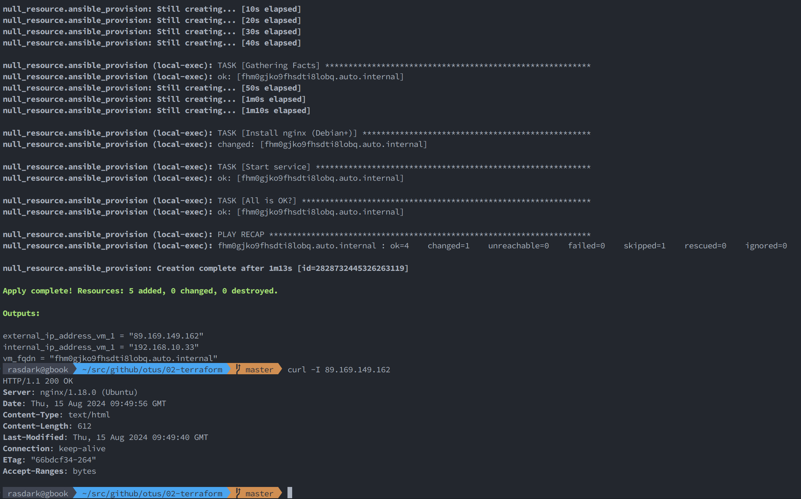

# OTUS HIGHLOAD

## Домашнее задание Terraform

*Задание*: реализовать разворачивание одной виртуалки в Yandex.Cloud с помощью terraform и запровизить туда nginx с помощью ansible.

<details>
<summary>Содержание</summary>

Устанавливаем terraform.

Устанавливаем утилиту yc (Yandex Cloud Cli).

Устанавливаем direnv (по-желанию).

Подкидываем провайдеру yandex необходимые креды с помощью переменных окружения (в моем случае это содержимое .envrc)

```shell
export YC_TOKEN=$(yc iam create-token)
export YC_CLOUD_ID=$(yc config get cloud-id)
export YC_FOLDER_ID=$(yc config get folder-id)
export YC_ZONE="ru-central1-a"
```

Использование YC_TOKEN, YC_CLOUD_ID, YC_FOLDER_ID таким образом избавит от необходимости держать креды в vars.

Решение находится в папке *02-terraform/*

*Примечание:* путь к ansible.cfg прокидывается с помощью переменной окружения (так же через .envrc)

```shell
cd 02-terraform
export ANSIBLE_CONFIG="$(pwd)/ansible/ansible.cfg"
```

Инициализируем

```shell
terraform init
```

Запускаем

```shell
terraform apply
```

Проверяем

```shell
curl -I http://<output from external_ip_address_vm_1>
```

Положительный результат, если curl выдал нечто подобное

```shell
$ curl -I 89.169.149.162
HTTP/1.1 200 OK
Server: nginx/1.18.0 (Ubuntu)
Date: Thu, 15 Aug 2024 09:49:56 GMT
Content-Type: text/html
Content-Length: 612
Last-Modified: Thu, 15 Aug 2024 09:49:40 GMT
Connection: keep-alive
ETag: "66bdcf34-264"
Accept-Ranges: bytes
```



</details>
